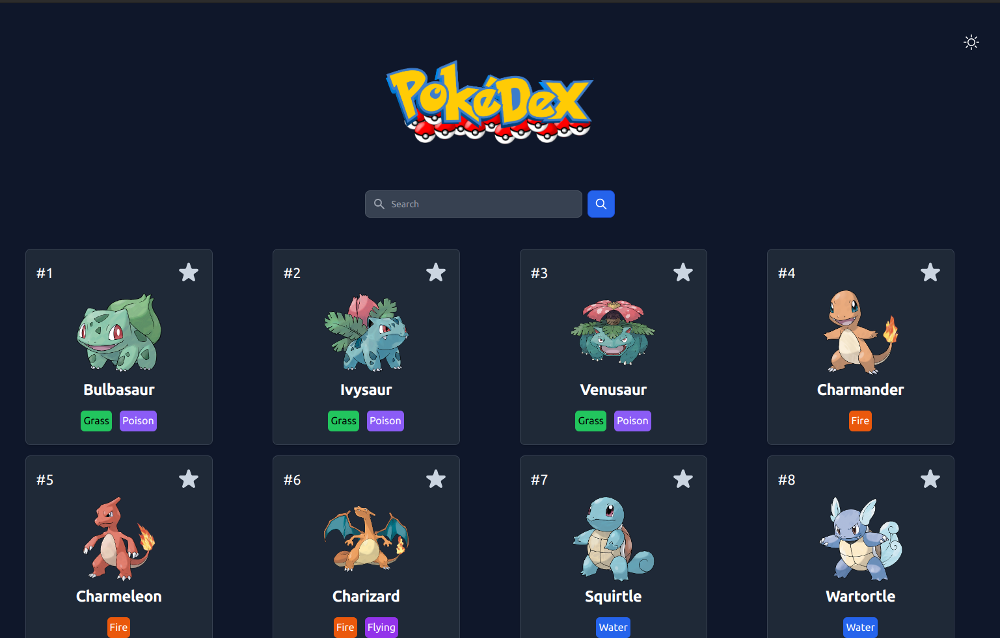

# Pokedex

With the [**Pokedex**](https://pokedex-tau.vercel.app "**Pokedex**") you can look for any pokemon of the first generation.



## Open API


Pokedex uses the [PokeAPI](https://pokeapi.co/), PokeAPI provides a RESTful API interface to highly detailed objects built from thousands of lines of data related to Pokémon.

## Installation  
```
npm install
```

## How to run 
```
npm run dev
```

## License
MIT
